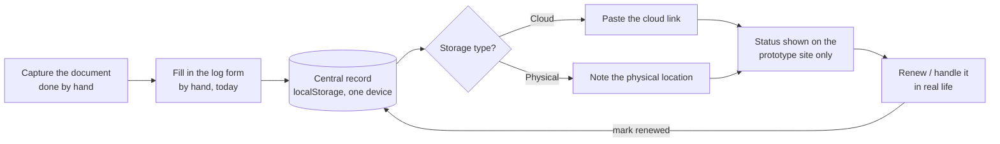
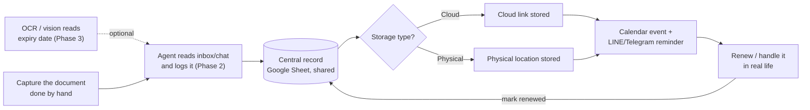

# Workflow draft — Document Cabinet

Draft for discussing the flow before touching the real prototype (`index.html`).
Two diagrams: how the prototype works today, and the automation target for
later.

## 1. Today — the prototype (Phase 1)

What actually happens right now when you log one document.

## 2. Future — automated (Phase 2, with Phase 3 as an optional add-on)

Same shape, but logging and reminding are no longer manual.

## 3. What belongs to which phase

Whether to skip straight from Phase 2 to Phase 3 can be decided later — this
is just a reasonable draft order.

| Phase | Capture | Log entry | Central record | Reminder |
|---|---|---|---|---|
| **Phase 1 — now** (prototype) | Photo/kept by hand as usual | Typed into the web form by hand | localStorage, single device | Only visible on-site, no real alert |
| **Phase 2** | Same as above | Agent reads/fills in from an inbox or chat | Google Sheet via Apps Script (shareable) | Apps Script creates a Calendar event + fires LINE/Telegram ahead of time |
| **Phase 3 — stretch** | Same as above | OCR/vision reads the expiry date from the photo automatically | Same as Phase 2 | Same as Phase 2 |
